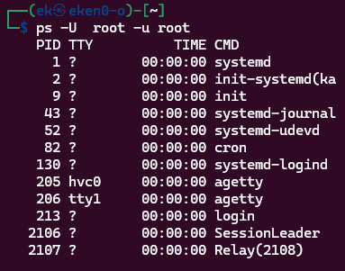
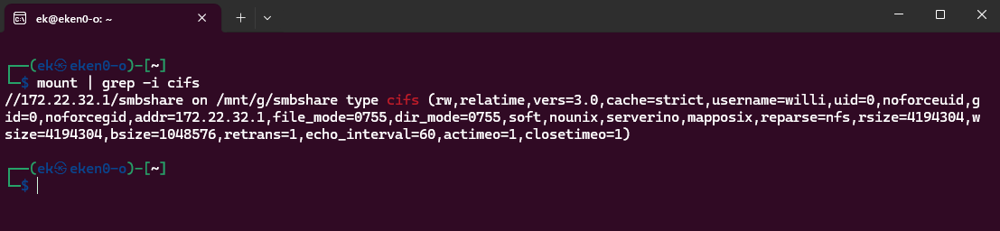
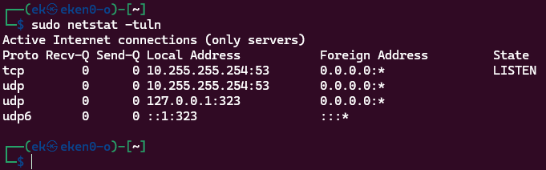

# Lab 1 - Linux Fundamentals & Networking

## Overview

This lab focuses on fundamental Linux system administration and networking concepts using Kali Linux. 
The task include inspecting system configuration, managing services, mounting remote filesystems, and using common administrative
and networking tools relevant in security contexts.

---

## Environment

- **Operating System:** [Kali Linux](https://www.kali.org)
- **Platform:** [WSL2 (Windows Subsystem for Linux)](https://learn.microsoft.com/en-us/windows/wsl/install)
- **User:** Non-root user with sudo privileges

---
## 1.1 Kali Linux Basic Usage
### Superuser (Root) Processes
To identify processes that normally require root privileges, the following command was used:
```
ps -U root -u root
```


## Mounting a Network Share (SMB/CIFS(
A network share was mounted using the SMB/CIFS protocol to demonstrate access to remote filesystems.

**Commands used:**
List available shares:
```
smbclient -L <IP_ADDRESS> -U <username>
```
Mount the SMB share:
```
sudo mount -t cifs //<IP_ADDRESS>/smbshare /mnt/g/smbshare -o username=<username>,vers=3.0
```
Verify the mount:
```
mount | grep -i cifs
```



## Active Listening TCP and UDP Ports
The command that was used:
```
sudo netstat -tuln
```
The output shows a limited number of listening services by default, including DNS on port 53 and NTP on port 323. This indicates a minimal attack surface.



## 1.2 Linux Kernel Parameters and System Information

### Kernel Version
The Linux kernel version running on the system was identified using:
```
uname -a
```
This command provides information about the kernel version, architecture, and build details.
### CPU Information
Detailed CPU Information such as vendor, model name, number of cores, and cache size was obtained by using:
```
lscpu
```
The system is running on an AMD Ryzen processor and is virtualized through WSL2.
### Boot Process
Information about the boot process during startup can be retrieved using:
```
dmesg
```
Additional boot-related information can be found in:
```
/var/log/boot.log
```
---
## 1.3 Linux Kernel and Modules
### 1.3.1 Kernel Module Management
The following commands are used to list, load and unload kernel modules.\
List loaded modules:
```
lsmod
```
Load a kernel module:
```
sudo modprobe <module>
```
Unload a kernel module:
```
sudo modprobe -r <module>
```
### 1.3.2 FUSE Kernel Module
To verify that the FUSE kernel module is enabled, the following commands were used:
```
lsmod | grep fuse
```
```
cat /proc/filesystems | grep fuse
```
If FUSE appears in the output, it indicates that FUSE support is enabled either as a built-in kernel Feature or a loadable module.

### 1.3.3 Linux Kernel Configuration
Kernel features such as supported file systems and processor families can be identified in the kernel configuration file (```.config ```) in the kernel source tree.
- ```=y``` indicates built-in kernel support.
- ```=m``` indicates a loadable module.
The common commands used to compile and install a Linux Kernel
```
make menuconfig
make -j$(nproc)
make modules_install
make install
update-initramfs -u
update-grub
```
Note: The kernel was not installed during the Lab (for obvious reasons).

## 1.4 Remote Access to Kali
### 1.4.1 SSH daemon
**Checking if the SSH is running:**
```
systemctl status ssh
```
This command checks whether the SSH daemon is active.

**Starting and stopping the SSH daemon:**
```
systemctl start ssh
systemctl stop ssh
```

### 1.4.2 Tmux - Terminal Multiplexing
[Tmux](https://www.redhat.com/en/blog/introduction-tmux-linux) is a terminal multiplexer that allows terminal sessions to persist even after logging out.
Create a new tmux session:
```
tmux new -s <name>
```
Detach from session:
```
Ctrl+b, d
```
Reattach to the session:
```
tmux attach -t <name>
```
If you're like me and forgot to enter a ```<name>``` it defaults to 0.

## 1.5 NetCat - Remote Connection
On my server machine I used the command:
```
nc -lvnp 4444
```
Which basically means that it's set to listening mode, with verbose output, no DNS lookup and that it listens to port 4444. Now it just waits for a connection.\
On the another WSL terminal, which becomes the client, I used the command:
```
nc <IP_ADDRESS> 4444
```
This connects the client to the server (previous command), which on the server terminal showed that the connection was successful.\
A TCP Connection was established between the client and server.

---
## Feedback
This lab was well structured and helped build a solid understanding of Linux system administration and networking.
Working through the tasks gave practical insight into kernel information, service management, and remote filesystem access. 
The hands-on exercises made it easier to connect theory with real system behavior and highlighted the importance of security-related concepts such as running services with
least privilege.

I look forward to the rest of the labs, and the course.
